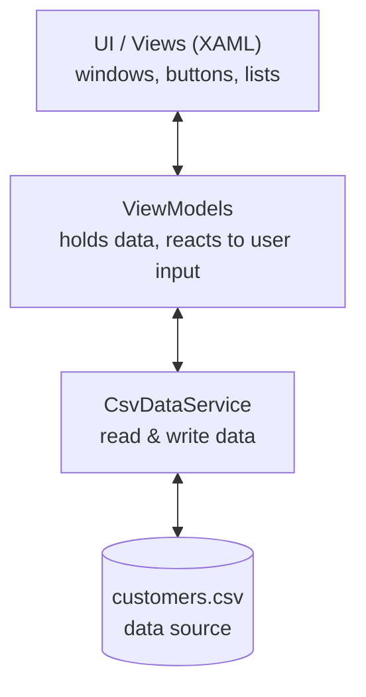

# Architecture

Provide a high-level overview of how your application is structured. The goal is that someone new can understand the main building blocks of your project and how they work together.

You are **free to choose how you explain your architecture**. Use whatever fits your project best, for example:

- a text-only description (see the example below)
- a simple illustration / box diagram
- a UML class diagram ([tutorial](https://www.visual-paradigm.com/guide/uml-unified-modeling-language/uml-class-diagram-tutorial/))
- a mix of the above

A UML diagram is welcome but **not required**. A clear text-only explanation is perfectly fine.

---

## Example 1: Text only

> Example for a **C# WPF desktop application** that uses a **CSV file as its data source**.

The application is a WPF desktop app and is organized in three layers:

1. **User Interface (Views)**
   The WPF windows and user controls (`.xaml`). They display the data and forward user
   actions (button clicks, text input) to the next layer. They contain no business logic.

2. **Logic (ViewModels & Services)**
   - The *ViewModels* hold the data shown in the UI and react to user actions.
   - A `CsvDataService` is responsible for reading and writing the data. It opens the CSV
     file, converts each line into a `Customer` object, and writes objects back into the
     CSV format when something changes.

3. **Data (CSV file)**
   A `customers.csv` file stored on disk acts as the database. Each row represents one
   record; the first row contains the column headers.

**Data flow (example: editing a customer):**
The user changes a value in the UI → the ViewModel updates the corresponding `Customer`
object → the `CsvDataService` writes all customers back to `customers.csv`. When the app
starts, the `CsvDataService` reads the file once and hands the list of customers to the
ViewModel, which makes them visible in the UI.

---

## Example 2: Simple illustration

The same structure as a small box diagram. The arrows show the direction of the data flow.

---

[Back to the overview](./../../README.md)
